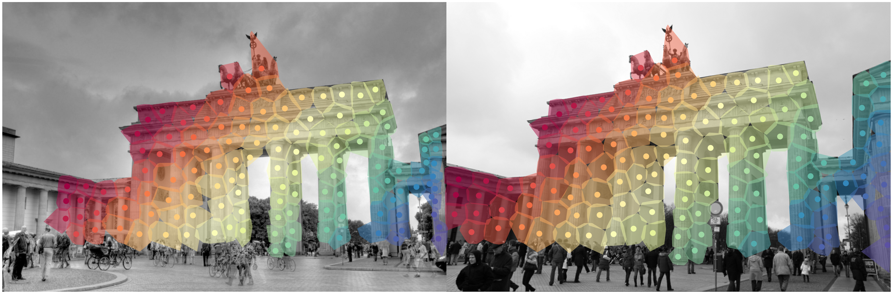

# Dense Match Summarization for Faster Two-view Estimation

<p align="middle">
  <h3 align="center">To be presented at CVPR 2025</h3>
  <h3 align="center">
  <a href="https://jastermark.github.io/DMS/">Project</a>
  |
  <a href="?">Paper</a>
  </h3>
</p>


Code coming soon.


<p align="center">
  <a href="https://scholar.google.com/citations?user=dsEPAvUAAAAJ&hl=sv&oi=ao">Jonathan Astermark</a>
  ·
  <a href="https://scholar.google.com/citations?user=9j-6i_oAAAAJ&hl=sv&oi=ao">Anders Heyden</a>
  ·
  <a href="https://vlarsson.github.io/">Viktor Larsson</a>
</p>


<p float="middle" align="middle">
  <br>
  
</p>


## BibTeX Citation
```
@inproceedings{astermark2024dense,
  author    = {Astermark, Jonathan and
               Heyden, Anders and
               Larsson, Viktor},
  title     = {Dense Match Summarization for Faster Two-view Estimation},
  booktitle = {Computer Vision and Pattern Recognition (CVPR)},
  year      = {2025}
}
```
