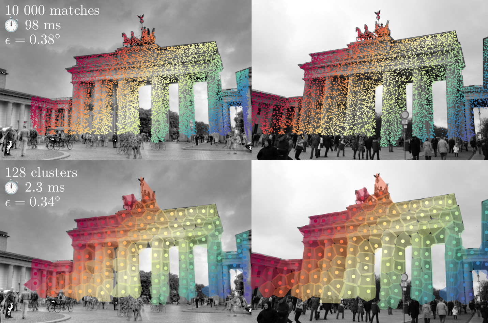

# Dense Match Summarization for Faster Two-view Estimation

<p align="middle">
  <h3 align="center">CVPR 2025</h3>
  <h3 align="center">
  <a href="https://jastermark.github.io/DMS/">Project page</a>
  |
  <a href="https://openaccess.thecvf.com//content/CVPR2025/papers/Astermark_Dense_Match_Summarization_for_Faster_Two-view_Estimation_CVPR_2025_paper.pdf">Paper</a>
  </h3>
</p>


<p align="center">
  <a href="https://jastermark.github.io/">Jonathan Astermark</a>
  ·
  <a href="https://scholar.google.com/citations?user=9j-6i_oAAAAJ&hl=sv&oi=ao">Anders Heyden</a>
  ·
  <a href="https://vlarsson.github.io/">Viktor Larsson</a>
</p>


<p float="middle" align="middle">
  
</p>


## Installation

1. Create virtual environment and install dependencies
```shell
python -m venv .venv
source .venv/bin/activate
python -m pip install --upgrade pip
python -m pip install -r requirements.txt
```

2. Install the dms package, as well as pysumopt (which contains the pybinds)
```shell
git submodule update --init --recursive
cd cpp && pip install --no-build-isolation --no-deps . && cd ..
pip install --no-build-isolation --no-deps -e .
```


## Example usage

The provided notebook `demo.ipynb` contains a small demo for estimating the relative pose from a single image pair.
To run the demo, you need the MegaDepth-1500 images and DKM-matches. You can download both using the provided shell script `data/download_megadepth.sh`:
```shell
cd data
bash download_megadepth.sh
cd ..
```

We also provide a notebook `run_benchmarks.ipynb` for running full evaluation on either MegaDepth-1500 or ScanNet-1500, using any matches (DKM and RoMa-matches are provided for download) **Note:** Before running the benchmarks, you need to run clustering using the provided script `run_clustering.py`. Example usage:
```shell
python run_clustering.py --dataset megadepth --keypoints roma --method kmeans4d --num_components 128
```


## BibTeX Citation
```
@inproceedings{astermark2025dense,
  author    = {Astermark, Jonathan and
               Heyden, Anders and
               Larsson, Viktor},
  title     = {Dense Match Summarization for Faster Two-view Estimation},
  booktitle = {Computer Vision and Pattern Recognition (CVPR)},
  year      = {2025}
}
```